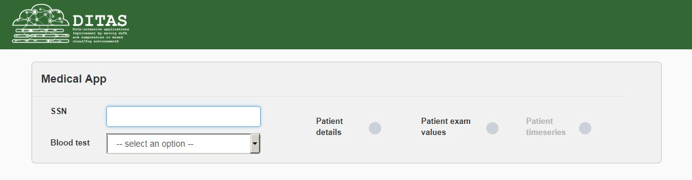
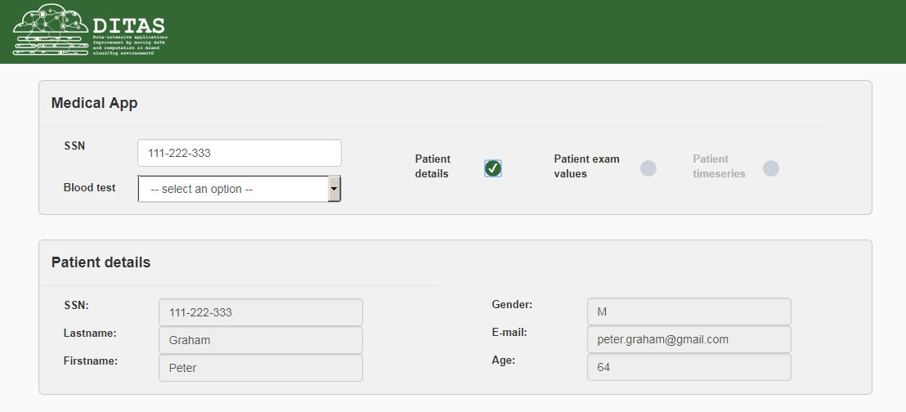
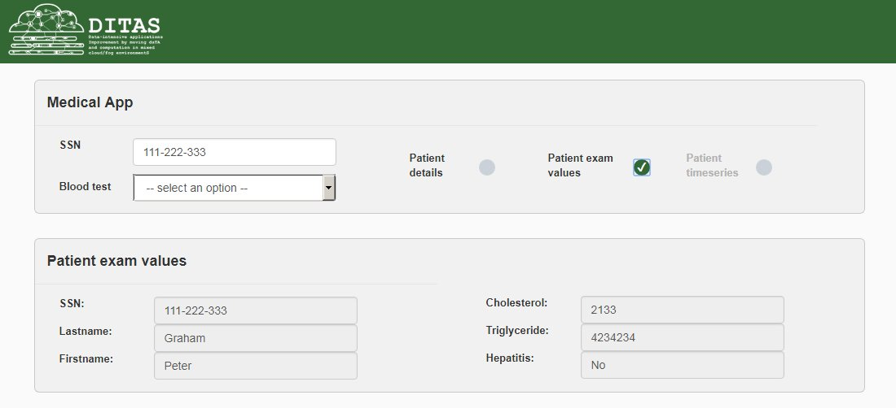
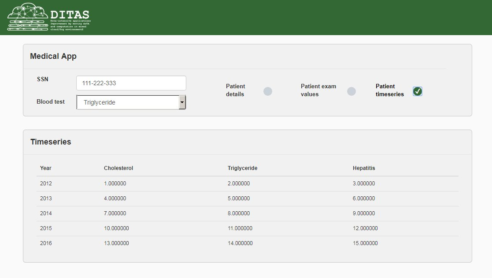

# Medical app for the DITAS dummy example

The medical app interface for the dummy example. At this stage it is a thin HTML+JS client that allows to make two calls:
1. Given a SSN returns all the details of the patient.
2. Given a SSN returns the last values for all the exams.
3. Given a SSN an a specific blood test (e.g. cholesterol) returns the timeseries of the value of this test for the given patient.

The applicaton will get the data by calling the VDC API. The JS files are already prepared to make data calls to the VDC as soon as the VDC part is ready. It just need to set the real endpint and some fine tuning to adapt to the VDC response data format.

# Some screenshots

These screenshots have been generated using dummy data, not real VDC calls.

